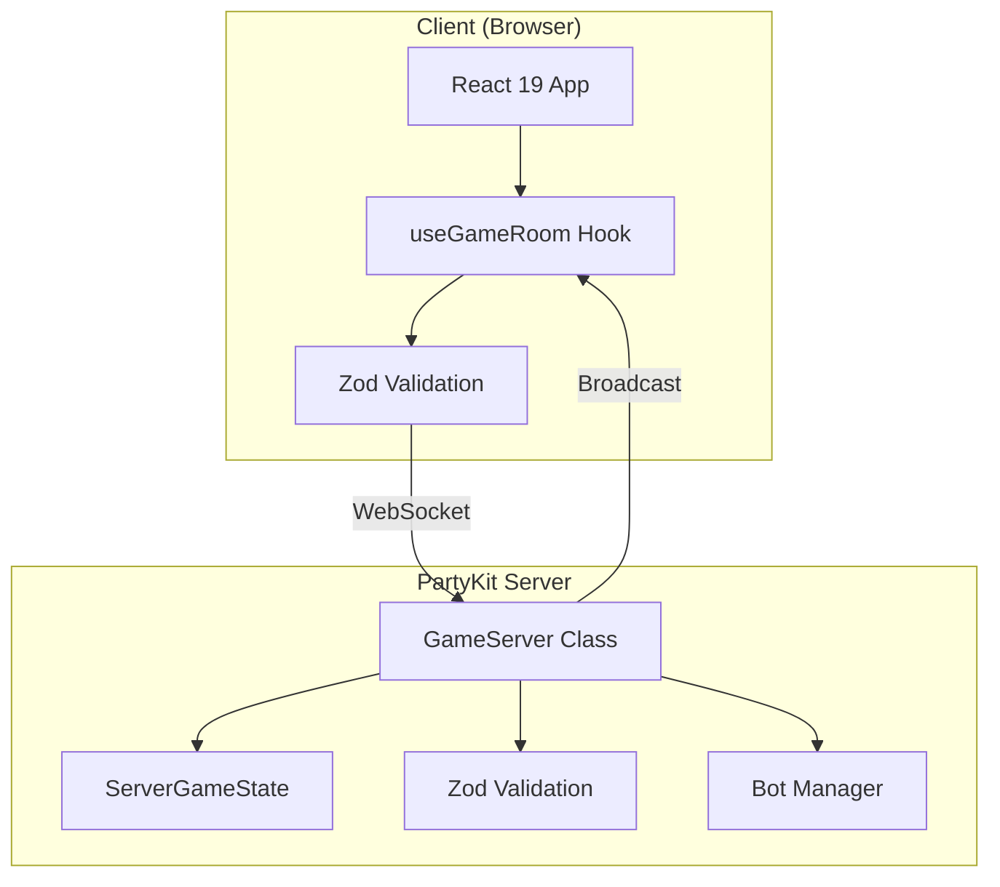

# Architecture

## Overview

Story Weaver follows a client-server architecture with real-time WebSocket communication via PartyKit.

---

## System Architecture



---

## Data Flow

### Client to Server

```
User Action
    ↓
React Component (onClick, onSubmit)
    ↓
useGameRoom Hook (action function)
    ↓
Zod Schema Validation
    ↓
WebSocket.send(JSON)
    ↓
PartyKit Server.onMessage()
    ↓
Zod Schema Validation
    ↓
Handler Function
    ↓
State Update
    ↓
broadcastState()
```

### Server to Client

```
State Change
    ↓
getPublicState(playerId)  // Filter sensitive data
    ↓
JSON.stringify()
    ↓
WebSocket broadcast
    ↓
Client onMessage
    ↓
setGameState()
    ↓
React Re-render
```

---

## Key Design Decisions

### 1. State Ownership

**Server is the source of truth**. The client never modifies game state directly; it sends actions and receives the updated state.

### 2. State Filtering

The server maintains `ServerGameState` with full data (including deck). Clients receive filtered `GameState`:
- Deck cards are hidden (only `deckCount` is sent)
- Other players' hands are hidden
- Votes are hidden until RESULTS phase

### 3. Connection Management

Each WebSocket connection is mapped to a player ID:

```typescript
connections: Map<string, string>  // connectionId -> playerId
```

This allows:
- Reconnection without losing player state
- Personalized state delivery
- Targeted error messages

### 4. Validation Strategy

Double validation ensures security:
1. **Client-side**: UX improvement, prevents obvious errors
2. **Server-side**: Security, prevents malicious requests

---

## Directory Structure

```
clues/
├── src/                    # Client code
│   ├── App.tsx             # Root component
│   ├── components/         # React components
│   │   ├── game/           # Game-specific components
│   │   └── screens/        # Full-page screens
│   ├── hooks/              # React hooks
│   │   └── useGameRoom.ts  # WebSocket connection
│   ├── types/              # TypeScript types
│   │   └── index.ts        # Shared type definitions
│   └── schemas/            # Zod schemas
│       └── messages.ts     # Message validation
├── party/                  # Server code
│   ├── server.ts           # Main PartyKit server
│   └── bots/               # Bot AI
│       ├── manager.ts      # Bot orchestration
│       └── ai.ts           # Bot decision logic
├── docs/                   # Documentation
│   ├── en/                 # English
│   └── pt-br/              # Portuguese
└── .agent/                 # AI agent context
    └── CONTEXT.md          # Quick reference
```

---

## Deployment

### Frontend (Vite)

```bash
npm run build  # Outputs to dist/
```

Deploy `dist/` to any static hosting (Vercel, Netlify, etc.)

### Backend (PartyKit)

```bash
npm run party:deploy
```

Deploys to PartyKit Cloud. Configuration in `partykit.json`:

```json
{
  "name": "clues",
  "main": "party/server.ts"
}
```

---

## Configuration Files

| File | Purpose |
|------|---------|
| `partykit.json` | PartyKit server config |
| `vite.config.ts` | Vite build config |
| `tsconfig.json` | TypeScript config |
| `game.config.json` | Game constants (deck size, etc.) |

---

## Related Documentation

- [Server Documentation](./SERVER.md)
- [Client Documentation](./CLIENT.md)
- [Message Types](./MESSAGES.md)
- [State Machine](./STATE_MACHINE.md)
