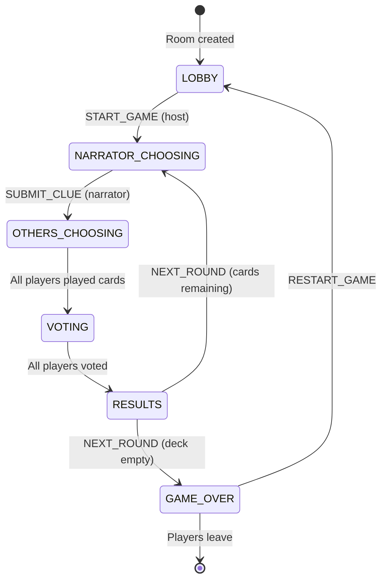

# Game State Machine

## Overview

The game follows a finite state machine with 6 distinct phases. Each phase has specific allowed actions and transitions.

---

## State Diagram



---

## Phase Details

### LOBBY

**Description**: Waiting room before game starts.

| Allowed Actions | Actor |
|-----------------|-------|
| `JOIN_ROOM` | Anyone |
| `LEAVE_ROOM` | Any player |
| `START_GAME` | Host only |
| `ADD_BOT` | Host only |
| `REMOVE_BOT` | Host only |

**Transition**: `START_GAME` → `NARRATOR_CHOOSING`

**Requirements**: Minimum 3 players to start.

---

### NARRATOR_CHOOSING

**Description**: Current narrator selects a card and writes a clue.

| Allowed Actions | Actor |
|-----------------|-------|
| `SUBMIT_CLUE` | Narrator only |

**State Data**:
- `narratorIndex` - Current narrator's index in players array
- `currentClue` - Empty until submitted

**Transition**: `SUBMIT_CLUE` → `OTHERS_CHOOSING`

---

### OTHERS_CHOOSING

**Description**: Non-narrator players select cards matching the clue.

| Allowed Actions | Actor |
|-----------------|-------|
| `PLAY_CARD` | Non-narrators |

**State Data**:
- `currentClue` - The narrator's clue
- `tableCards` - Accumulates as players submit

**Transition**: All non-narrators played → `VOTING`

---

### VOTING

**Description**: All players (except narrator) vote on which card is the narrator's.

| Allowed Actions | Actor |
|-----------------|-------|
| `VOTE` | Non-narrators |

**State Data**:
- `tableCards` - All cards shuffled with orderId
- `votes` - Map of playerId → orderId

**Rules**:
- Cannot vote for own card
- Narrator cannot vote

**Transition**: All eligible players voted → `RESULTS`

---

### RESULTS

**Description**: Scores are calculated and displayed.

| Allowed Actions | Actor |
|-----------------|-------|
| `NEXT_ROUND` | Any player |

**Scoring Logic**:
- If everyone or no one guessed correctly: Narrator gets 0, others get 2
- Otherwise: Narrator and correct guessers get 3
- Each vote on your card: +1 point (except narrator's card)

**Transition**: 
- `NEXT_ROUND` (deck has cards) → `NARRATOR_CHOOSING`
- `NEXT_ROUND` (deck empty) → `GAME_OVER`

---

### GAME_OVER

**Description**: Game ended, winner displayed.

| Allowed Actions | Actor |
|-----------------|-------|
| `RESTART_GAME` | Any player |

**State Data**:
- `winner` - Player ID of winner (highest score)

**Transition**: `RESTART_GAME` → `LOBBY`

---

## GameState Interface

```typescript
interface GameState {
  roomCode: string;
  phase: GamePhase;
  players: Player[];
  narratorIndex: number;
  currentClue: string;
  tableCards: TableCard[];
  votes: Record<string, number>;
  winner: string | null;
  deckCount: number;
  victoryCondition: VictoryCondition;
  narratorRoundsPlayed: Record<string, number>;
  deckOption: DeckOption;
  afkKickVotes: Record<string, string[]>;
  phaseTimeouts: PhaseTimeouts;
  phaseStartTime: number | null;
}
```

---

## Narrator Rotation

After each round, the narrator index advances to the next connected, active player:

```typescript
let nextIndex = (narratorIndex + 1) % players.length;
while (!players[nextIndex].isConnected || players[nextIndex].isSpectator) {
  nextIndex = (nextIndex + 1) % players.length;
}
narratorIndex = nextIndex;
```

---

## Related Documentation

- [Server Documentation](./SERVER.md)
- [Client Documentation](./CLIENT.md)
- [Message Types](./MESSAGES.md)
