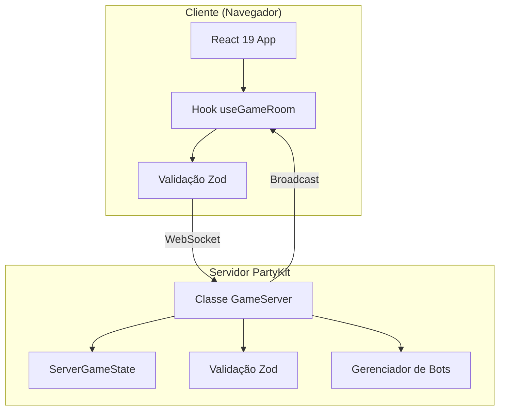

# Arquitetura

## Visão Geral

Story Weaver segue uma arquitetura cliente-servidor com comunicação WebSocket em tempo real via PartyKit.

---

## Arquitetura do Sistema



---

## Fluxo de Dados

### Cliente para Servidor

```
Ação do Usuário
    ↓
Componente React (onClick, onSubmit)
    ↓
Hook useGameRoom (função de ação)
    ↓
Validação Schema Zod
    ↓
WebSocket.send(JSON)
    ↓
PartyKit Server.onMessage()
    ↓
Validação Schema Zod
    ↓
Função Handler
    ↓
Atualização de Estado
    ↓
broadcastState()
```

### Servidor para Cliente

```
Mudança de Estado
    ↓
getPublicState(playerId)  // Filtra dados sensíveis
    ↓
JSON.stringify()
    ↓
WebSocket broadcast
    ↓
Cliente onMessage
    ↓
setGameState()
    ↓
Re-render React
```

---

## Decisões de Design Principais

### 1. Propriedade do Estado

**Servidor é a fonte da verdade**. O cliente nunca modifica o estado do jogo diretamente; envia ações e recebe o estado atualizado.

### 2. Filtragem de Estado

O servidor mantém `ServerGameState` com dados completos (incluindo baralho). Clientes recebem `GameState` filtrado:
- Cartas do baralho são ocultas (apenas `deckCount` é enviado)
- Mãos de outros jogadores são ocultas
- Votos são ocultos até fase RESULTS

### 3. Gerenciamento de Conexões

Cada conexão WebSocket é mapeada para um ID de jogador:

```typescript
connections: Map<string, string>  // connectionId -> playerId
```

Isso permite:
- Reconexão sem perder estado do jogador
- Entrega de estado personalizado
- Mensagens de erro direcionadas

### 4. Estratégia de Validação

Validação dupla garante segurança:
1. **Lado do cliente**: Melhoria de UX, previne erros óbvios
2. **Lado do servidor**: Segurança, previne requisições maliciosas

---

## Estrutura de Diretórios

```
clues/
├── src/                    # Código do cliente
│   ├── App.tsx             # Componente raiz e roteador
│   ├── components/         # Componentes React
│   │   ├── game/           # Componentes específicos do jogo
│   │   └── screens/        # Telas de página inteira
│   │       ├── lobby/      # Sub-componentes do lobby
│   │       └── game/       # Sub-componentes do jogo
│   ├── hooks/              # React hooks
│   │   ├── useGameRoom.ts  # Hook de fachada (Facade) do jogo
│   │   └── game/           # Hooks de conexão e ações
│   │       ├── useGameSocket.ts
│   │       └── useGameActions.ts
│   ├── providers/          # Provedores de contexto React
│   │   └── GameSessionProvider.tsx # Estado persistente da sessão
│   ├── types/              # Tipos TypeScript
│   │   └── index.ts        # Definições de tipos compartilhados
│   └── schemas/            # Schemas Zod
│       └── messages.ts     # Validação de mensagens
├── party/                  # Código do servidor
│   ├── server.ts           # Despachante principal do servidor PartyKit
│   ├── handlers/           # Handlers de mensagens e lógica
│   │   ├── room.ts         # Gerenciamento de lobby e sala
│   │   ├── game.ts         # Lógica central do jogo
│   │   ├── spectator.ts    # Lógica de espectadores
│   │   ├── afk.ts          # Lógica de AFK e progressão
│   │   └── bot.ts          # Lógica de gerenciamento de bots
│   └── bots/               # IA dos bots
│       ├── manager.ts      # Orquestração de bots
│       └── ai.ts           # Lógica de decisão dos bots
├── docs/                   # Documentação
│   ├── en/                 # Inglês
│   └── pt-br/              # Português
└── .agent/                 # Contexto para agentes de IA
    └── CONTEXT.md          # Referência rápida
```

---

## Deploy

### Frontend (Vite)

```bash
npm run build  # Saída para dist/
```

Deploy de `dist/` para qualquer hospedagem estática (Vercel, Netlify, etc.)

### Backend (PartyKit)

```bash
npm run party:deploy
```

Faz deploy para PartyKit Cloud. Configuração em `partykit.json`:

```json
{
  "name": "clues",
  "main": "party/server.ts"
}
```

---

## Arquivos de Configuração

| Arquivo | Propósito |
|---------|-----------|
| `partykit.json` | Config do servidor PartyKit |
| `vite.config.ts` | Config de build do Vite |
| `tsconfig.json` | Config do TypeScript |
| `game.config.json` | Constantes do jogo (tamanho do baralho, etc.) |

---

## Documentação Relacionada

- [Documentação do Servidor](./SERVER.md)
- [Documentação do Cliente](./CLIENT.md)
- [Tipos de Mensagens](./MESSAGES.md)
- [Máquina de Estados](./STATE_MACHINE.md)
