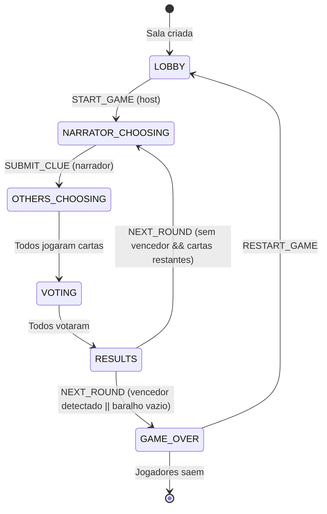

# Máquina de Estados do Jogo

## Visão Geral

O jogo segue uma máquina de estados finita com 6 fases distintas. Cada fase tem ações e transições permitidas específicas.

---

## Diagrama de Estados



---

## Detalhes das Fases

### LOBBY

**Descrição**: Sala de espera antes do jogo começar.

| Ações Permitidas | Ator |
|------------------|------|
| `JOIN_ROOM` | Qualquer pessoa |
| `LEAVE_ROOM` | Qualquer jogador |
| `START_GAME` | Apenas host |
| `ADD_BOT` | Apenas host |
| `REMOVE_BOT` | Apenas host |
| `TOGGLE_SPECTATOR` | Host (qualquer), Jogador (próprio) |
| `REQUEST_PLAY` | Espectador |

**Transição**: `START_GAME` → `NARRATOR_CHOOSING`

**Requisitos**: Mínimo 3 jogadores para iniciar.

---

### NARRATOR_CHOOSING

**Descrição**: Narrador atual seleciona uma carta e escreve uma dica.

| Ações Permitidas | Ator |
|------------------|------|
| `SUBMIT_CLUE` | Apenas narrador |

**Dados do Estado**:
- `narratorIndex` - Índice do narrador atual no array de jogadores
- `currentClue` - Vazio até ser enviada
 
**Transição**: `SUBMIT_CLUE` → `OTHERS_CHOOSING`

---

### OTHERS_CHOOSING

**Descrição**: Jogadores não-narradores selecionam cartas que combinam com a dica.

| Ações Permitidas | Ator |
|------------------|------|
| `PLAY_CARD` | Não-narradores |

**Dados do Estado**:
- `currentClue` - A dica do narrador
- `tableCards` - Acumula conforme jogadores enviam

**Transição**: Todos não-narradores jogaram → `VOTING`

---

### VOTING

**Descrição**: Todos os jogadores (exceto narrador) votam em qual carta é a do narrador.

| Ações Permitidas | Ator |
|------------------|------|
| `VOTE` | Não-narradores |

**Dados do Estado**:
- `tableCards` - Todas as cartas embaralhadas com orderId
- `votes` - Mapa de playerId → orderId

**Regras**:
- Não pode votar na própria carta
- Narrador não pode votar

**Transição**: Todos jogadores elegíveis votaram → `RESULTS`

---

### RESULTS

**Descrição**: Pontuações são calculadas e exibidas. Mesmo se um vencedor for detectado durante o cálculo, o jogo transita primeiro para RESULTS para que os jogadores possam ver a última rodada e as pontuações finais antes de encerrar o jogo.

| Ações Permitidas | Ator |
|------------------|------|
| `NEXT_ROUND` | Qualquer jogador |

**Lógica de Pontuação**:
- Se todos ou ninguém acertou: Narrador ganha 0, outros ganham 2
- Caso contrário: Narrador e quem acertou ganham 3
- Cada voto na sua carta: +1 ponto (exceto carta do narrador)

**Transição**: 
- `NEXT_ROUND` (sem vencedor e baralho tem cartas) → `NARRATOR_CHOOSING`
- `NEXT_ROUND` (vencedor detectado ou baralho vazio) → `GAME_OVER`

---

### GAME_OVER

**Descrição**: Jogo terminou, vencedor exibido.

| Ações Permitidas | Ator |
|------------------|------|
| `RESTART_GAME` | Qualquer jogador |

**Dados do Estado**:
- `winner` - ID do jogador vencedor (maior pontuação)

**Transição**: `RESTART_GAME` → `LOBBY`

---

## Terminação do Jogo

- **Jogadores Insuficientes**: Se a qualquer momento durante um jogo ativo (qualquer fase exceto LOBBY e GAME_OVER) o número de jogadores ativos (não espectadores) cair abaixo do mínimo necessário (3), o jogo transita imediatamente para `GAME_OVER`. O jogador com a maior pontuação naquele momento é declarado o vencedor.

---

## Interface GameState

```typescript
interface GameState {
  roomCode: string;
  phase: GamePhase;
  players: Player[];
  narratorIndex: number;
  currentClue: string;
  tableCards: TableCard[];
  votes: Record<string, number>;
  winner: string | null;
  deckCount: number;
  victoryCondition: VictoryCondition;
  narratorRoundsPlayed: Record<string, number>;
  deckOption: DeckOption;
  afkKickVotes: Record<string, string[]>;
  phaseTimeouts: PhaseTimeouts;
  phaseStartTime: number | null;
}
```

---

## Rotação do Narrador

Após cada rodada, o índice do narrador avança para o próximo jogador ativo e conectado:

```typescript
let nextIndex = (narratorIndex + 1) % players.length;
while (!players[nextIndex].isConnected || players[nextIndex].isSpectator) {
  nextIndex = (nextIndex + 1) % players.length;
}
narratorIndex = nextIndex;
```

---

## Documentação Relacionada

- [Documentação do Servidor](./SERVER.md)
- [Documentação do Cliente](./CLIENT.md)
- [Tipos de Mensagens](./MESSAGES.md)
